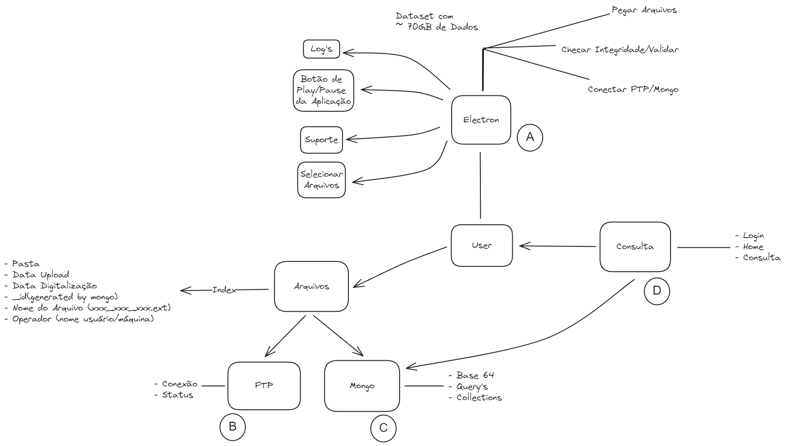
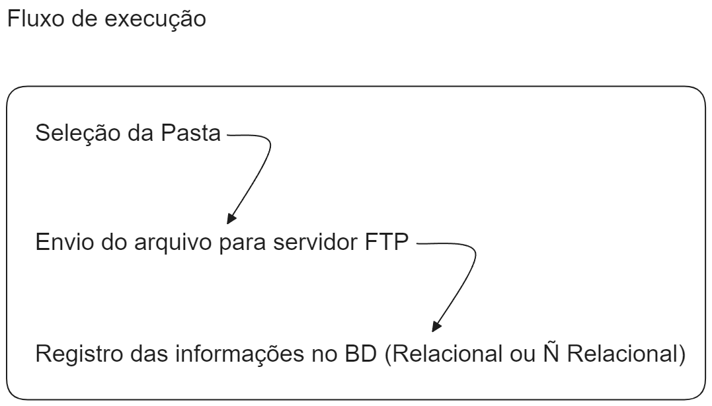
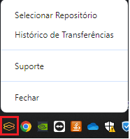
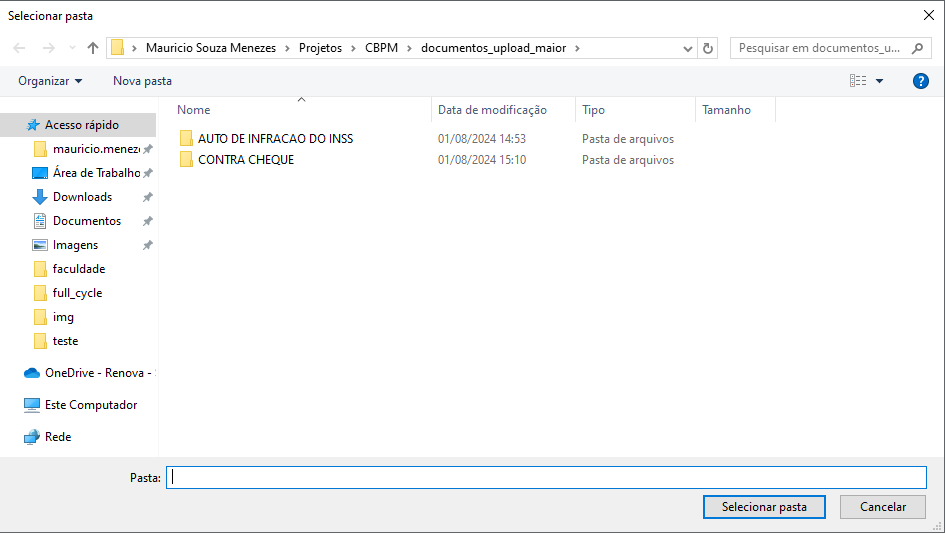
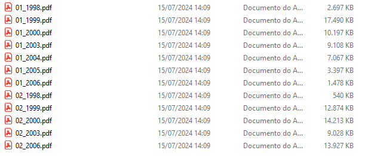
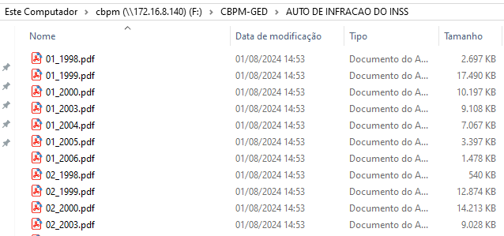
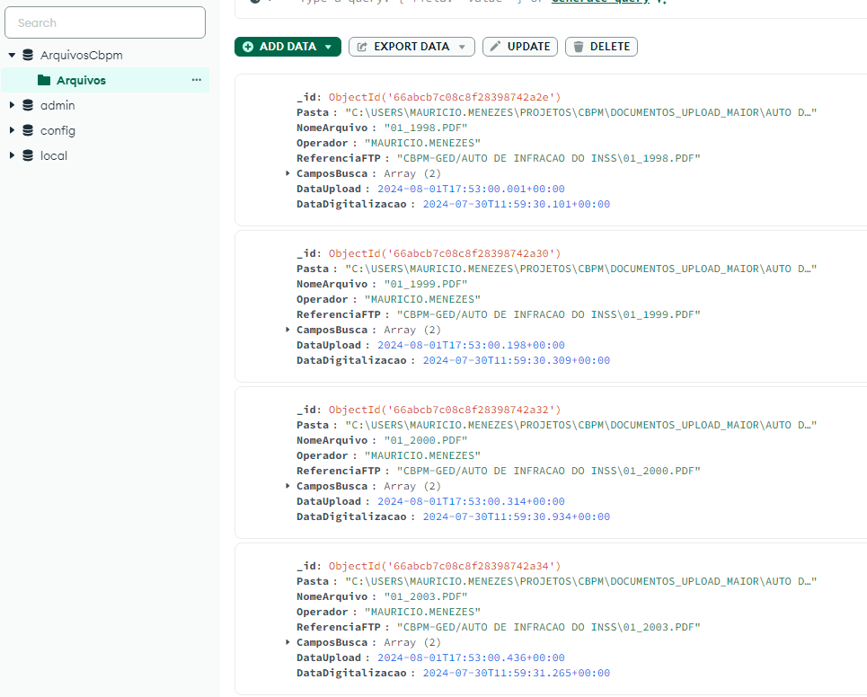
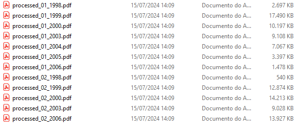

<!-- markdownlint-disable MD025 MD033 MD003 MD024 -->

# CBPM

## Sistema de Upload de Arquivos

 
 
 

---

## Apresentação

Este documento tem como objetivo apresentar o sistema de upload de arquivos da CBPM, que tem como finalidade o armazenamento de arquivos de diversos tipos, bem como o armazenamento de metadados associados a esses arquivos em um banco de dados.

---

## Arquitetura do Sistema

<!-- Imagem da Arquitetura do Sistema -->

---

## Arquitetura do Sistema

 

---

## Tecnologias Utilizadas

- Electron
- Node.js
- MongoDB
- Prisma ORM
- Dotenv

---

## Fluxo de Execução

1. O ***usuário*** seleciona a pasta que deseja fazer o upload dos arquivos.
2. O ***sistema*** faz um processo de varredura na pasta selecionada, entrando em todas as subpastas, caso existam.
3. O ***sistema*** faz a leitura dos arquivos, de forma individual, juntamente com os metadados associados a eles.
4. O ***sistema*** faz o envio dos arquivos para o servidor ftp.
5. O ***sistema*** faz a inserção dos metadados do arquivo no banco de dados.
6. O ***sistema*** faz uma marcação no arquivo, adicionando um prefixo no seu nome, indicando que o mesmo já foi processado.

---

## Fluxo de Execução

<!-- O sistema foi pensado para ser executado em um ambiente *headless*, ou seja, sem a necessidade de interação com o usuário. O sistema é executado em *background*, de forma automática, sem a necessidade de intervenção humana. -->

O sistema foi pensado para ser executado como um ***tray application***, ou seja, um aplicativo que roda na bandeja do sistema.

---

## Fluxo de Execução

O gerenciador de arquivos é aberto e o usuário seleciona a pasta que deseja fazer o upload dos arquivos.

---

## Fluxo de Execução

Exemplo de arquivos antes do processamento.

---

## Fluxo de Execução

Arquivos processados salvos no servidor FTP.

---

## Fluxo de Execução

Metadados dos arquivos salvos no banco de dados (MongoDB).

---

## Fluxo de Execução

O sistema faz a marcação dos arquivos "locais" processados, adicionando um prefixo no nome do arquivo.

---

## Dúvidas❓❓❓
